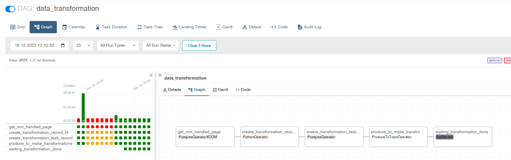
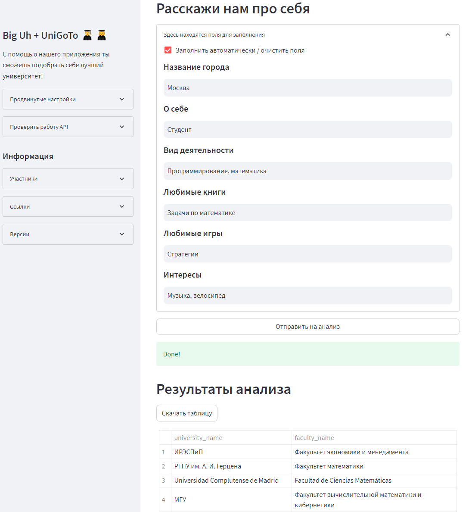

# unigoto

> Инструмент используется для предложения пользователям наиболее подходящих вариантов университетов и факультетов на основании их интересов и предпочтений.

Здесь представлена часть кода по хакатону `UrFU + UniGoTo` от моей команды, соответствующая практическому заданию №4 по предмету MLOps с использованием `AirFlow` для периодической обработки данных. 

Данный код реализует постоянную загрузку сырых данных из `unigoto.ru/api` в базу данных `PostGreSQL` посредством контейнера `data-collector`. 

`AirFlow` используется для запуска периодической задачи, которая преобразует новые данные из API в эмбединги (при помощи **SentenceTransformer**) и складывает их в БД с расширением **pgvector**.

Выдача результатов анализа подходящего университета реализуется с помощью перевода введенных пользователем данных в эмбединг и поиском наименьшего косинусного расстояния по существующей базе. Взаимодействие с базой данных осуществляется с помощью `FastAPI`. Благодаря периодическому запуску преобразования новых данных в эмбединги с помощью `AirFlow` эффективность такого поиска постоянно увеличивается.

Для удобства взаимодействия с инструментом реализован пользовательский web-интерфейс на основе библиотеки `Streamlit`.

## AirFlow



## Streamlit



## Project structure
```shell
.
│   .gitignore
│   docker-compose.local.yml
│   docker-compose.yml
│   pyproject.toml
│   README.md
│   requirements-dev.txt
│
├───configs
│   ├───dev
│   │   │   .env
│   │   │
│   │   ├───h-data-pg
│   │   │   └───docker-entrypoint-initdb.d
│   │   │           0_initial_postgresql.sql
│   │   │
│   │   └───nginx
│   │       │   nginx.conf
│   │       │
│   │       └───conf.d
│   │               h.conf
│   │
│   └───local
│       │   .env
│       │
│       ├───h-data-pg
│       │   └───docker-entrypoint-initdb.d
│       │           0_initial_postgresql.sql
│       │
│       └───nginx
│           │   nginx.conf
│           │
│           └───conf.d
│                   h.conf
│
├───img
│       airflow.png
│       architecture.png
│
├───src
│   ├───airflow
│   │   │   Dockerfile
│   │   │   requirements-dev.txt
│   │   │   requirements.txt
│   │   │   __init__.py
│   │   │
│   │   └───dags
│   │       │   __init__.py
│   │       │
│   │       └───h_dags
│   │               data_transformation.py
│   │               h_dags.py
│   │               __init__.py
│   │
│   ├───api
│   │   │   .dockerignore
│   │   │   .gitignore
│   │   │   config.py
│   │   │   Dockerfile
│   │   │   main.py
│   │   │   models.py
│   │   │   pyproject.toml
│   │   │   requirements.txt
│   │   │   utils.py
│   │   │
│   │   └───api
│   │       │   router.py
│   │       │   schemas.py
│   │       │   __init__.py
│   │       │
│   │       └───endpoints
│   │               ping.py
│   │               search.py
│   │               __init__.py
│   │
│   ├───client
│   │       config.py
│   │       Dockerfile
│   │       requirements.txt
│   │       unigoto.py
│   │
│   ├───data_collector
│   │   │   config.py
│   │   │   Dockerfile
│   │   │   models.py
│   │   │   requirements.txt
│   │   │   __main__.py
│   │   │
│   │   └───scripts
│   │           init_db_tables.py
│   │           __init__.py
│   │
│   └───workers
│           config.py
│           Dockerfile
│           models.py
│           requirements-dev.txt
│           requirements.txt
│           transformator.py
│
└───volumes
        .gitkeep
```

# Dev
```shell
cp configs/dev/.env .env
```
- add COLLECTOR_ACCESS_TOKEN to .env

up db
```shell
docker compose up -d --build h-data-pg
```
create tables
```shell
docker compose run --rm --no-deps data-collector sh -c 'python -m scripts.init_db_tables'
```
run collector
```shell
docker compose up -d --build data-collector
```
run all services
```shell
docker compose up -d --build
```

### utils
```shell
docker compose logs -n 100 data-collector
docker compose exec h-data-pg psql -U h_user -d h_core
```
```postgresql
UPDATE h_raw_data
SET about = regexp_replace(about, E'[\\n\\r]+', ' ', 'g' ),
    activities=regexp_replace(activities, E'[\\n\\r]+', ' ', 'g' ),
    books=regexp_replace(books, E'[\\n\\r]+', ' ', 'g' ),
    games=regexp_replace(games, E'[\\n\\r]+', ' ', 'g' ),
    interests=regexp_replace(interests, E'[\\n\\r]+', ' ', 'g' ),
    university_name=regexp_replace(university_name, E'[\\n\\r]+', ' ', 'g' ),
    faculty_name=regexp_replace(faculty_name, E'[\\n\\r]+', ' ', 'g' );

SELECT count(DISTINCT page_number)
FROM h_raw_data;

SELECT min(page_number)
FROM h_raw_data;

SELECT count(*)
FROM h_raw_data;

COPY h_raw_data TO '/csv/h_raw_data.csv' DELIMITER ',' CSV HEADER;

COPY (SELECT *
      FROM h_raw_data
      WHERE education_status IN
            ('Выпускник (бакалавр)', 'Выпускник (магистр)', 'Выпускник (специалист)', 'Выпускница (бакалавр)',
             'Выпускница (магистр)',
             'Выпускница (специалист)')) to '/csv/graduates.csv' with (format csv, DELIMITER ',', HEADER);
```
# Develop
create DB
```shell
cat configs/dev/h-data-pg/docker-entrypoint-initdb.d/0_initial_postgresql.sql | psql -U postgres
```
export env variables
```shell
export $(grep -v '^#' configs/dev/.env | xargs)
```
create DB tables
```shell
python -m src.data_collector.scripts.init_db_tables
```
